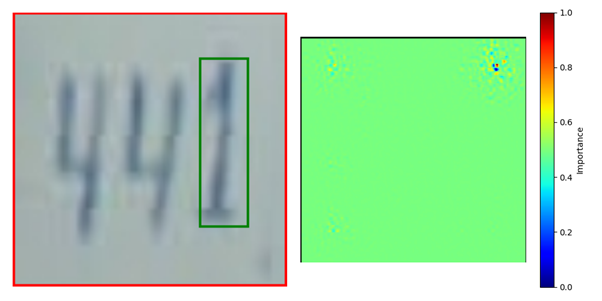
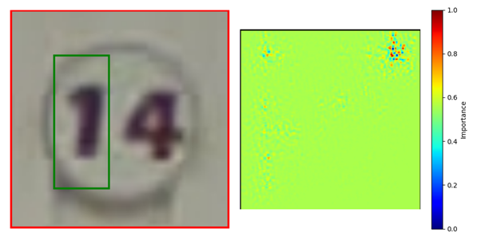

# SVHN Dataset Classifier with Explainable AI

This repository encompasses a sophisticated neural network designed for the classification of the Street View House Numbers (SVHN) dataset. The primary objective extends beyond mere accuracy; it seeks to embed model explainability, a critical facet imperative for various professional applications.

## Table of Contents
- [Introduction](#introduction)
- [Acknowledgements](#acknowledgements)
- [Getting Started](#getting-started)
    - [Dependencies](#dependencies)
    - [Setup](#setup)
- [Model Architecture](#model-architecture)
- [Usage](#usage)
- [Results & Visualization](#results--visualization)
- [Weights & Biases Integration](#weights--biases-integration)
- [Existing Tools](#Existing-Tools)

## Introduction
I am a summer intern at Zuse Institute Berlin (ZIB), aiming to learn about the domain of Explainable AI.

## Acknowledgements
I wish to express my profound gratitude to Turan Berkant for his invaluable supervision and Dr. Stephan Walchand for allowing me this internship opportunity.

## Getting Started

### Dependencies
Check the environment.yml file. 
### Setup
N/A (will update later)

## Model Architecture
The underlying architecture is predicated on the ResNet-18 model. It has been tailored to facilitate binary classification, with a primary focus on identifying a specific target digit within the customised SVHN dataset.

## Usage
To employ the model, at this stage just execute the primary Python script (main.py).

## Results & Visualization
Upon the culmination of the training process, a graphical representation will be generated, elucidating the training and test losses, in addition to accuracies, plotted against the epochs. 

## Weights & Biases Integration
The framework has been integrated with Weights & Biases for meticulous experiment tracking. It is imperative to have an active Weights & Biases account and a designated project to effectively log and monitor the experiments.

## Existing Tools

### IoU Defitions

The core difference between the two methods is that the first one looks at pixel-level overlap, while the second one looks at bounding box-level overlap.

IoU_1
A binary mask is created from the heatmap by setting values above a threshold to 1 and the rest to 0.
Another binary mask is created based on the provided bounding boxes.
The intersection is calculated by multiplying these two binary masks element-wise. The sum of this result gives the number of overlapping pixels.
The union is obtained by adding the two binary masks and counting the non-zero pixels.
IoU is then calculated as the ratio of the intersection to the union.

IoU_2
A bounding box is extracted from the binary heatmap mask. This box encloses all the "activated" areas of the heatmap.
IoU is calculated by finding the overlap (intersection) between this bounding box and the ground truth bounding box and then dividing by the combined area of the two bounding boxes (union).
The intersection's dimensions are found by taking the maximum of the starting x and y coordinates and the minimum of the ending x and y coordinates of the two bounding boxes. The intersection area is the product of its width and height.
The union area is the sum of the areas of the two bounding boxes minus the intersection area.

### Key Parameters of Existing Explainable Tools

| Method                 | Parameter               | Description                                                                                           |
|------------------------|-------------------------|-------------------------------------------------------------------------------------------------------|
| Integrated Gradients   | `n_steps`               | Number of steps in the path integral approximation. Larger values can be more accurate but intensive. |
| Saliency               | -                       | No parameters to tune.                                                                                |
| DeepLift               | `baseline`              | A reference input to compare each input to. Choice affects the attributions.                          |
| DeepLiftShap           | `baseline`              | Same as DeepLift, the baseline reference can be important.                                            |
| GradientShap           | `baselines`             | Randomly sampled reference inputs.                                                                     |
|                        | `n_samples`             | Number of random samples per input sample.                                                             |
| Input X Gradient       | -                       | No specific parameters to optimize.                                                                    |
| Guided Backprop        | -                       | No specific parameters to optimize.                                                                    |
| Guided GradCAM         | `layer`                 | Specific layer for computing GradCAM. Affects resolution and focus of attributions.                    |
| Deconvolution          | -                       | No specific parameters to optimize.                                                                    |
| Feature Ablation       | -                       | No specific parameters to optimize.                                                                    |
| Occlusion              | `sliding_window_shapes` | Size of the patch to occlude parts of the input.                                                       |
|                        | `strides`               | Step size for the sliding window.                                                                      |
| Feature Permutation    | -                       | No specific parameters to optimize.                                                                    |
| Shapley Value Sampling | `n_samples`             | Number of Monte Carlo samples for Shapley values.                                                      |
| Lime                   | `n_samples`             | Number of perturbed samples for the surrogate model.                                                   |
|                        | `perturbations_per_eval`| Number of perturbations computed simultaneously, balancing computation vs. memory usage.               |
| KernelShap             | `n_samples`             | Number of samples to average over.                                                                     |
|                        | `baselines`             | Baseline samples for comparison.                                                                       |
| LRP                    | `rule`                  | Propagation rule, e.g., "Z" or "Z^+". Affects relevance distribution.                                 |

### Integrated Gradients

